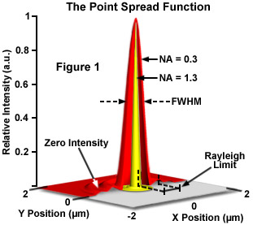

# ¿Qué es la PSF? 

La PSF (Point Spread Function) describe cómo un sistema óptico responde ante una fuente puntual. Idealmente, un punto debería producir una imagen puntual, pero debido a las limitaciones del sistema como difracción, aberraciones o el diseño del sensor, ese punto aparece expandido o “barrido” en el plano de imagen.

<table>
  <tr>
    <td align="center">
       
      <em>Figura 1a. Ejemplo de PSF 2D</em>
    </td>
    <td align="center">
       
      <em>Figura 1b. Convolución de un objeto con la PSF</em>
    </td>
  </tr>
</table>

En 3D, esto se traduce en un volumen que muestra cómo la energía de ese punto se dispersa espacialmente, sobre todo con más precisión lateral (XY) que axial (Z) en muchos microscopios. Esta función es clave porque actúa como “huella” del sistema: toda imagen adquirida es, en cierto modo, la convolución de la realidad con esa PSF. Por eso, conocerla permite corregir distorsiones a través de deconvolución.
