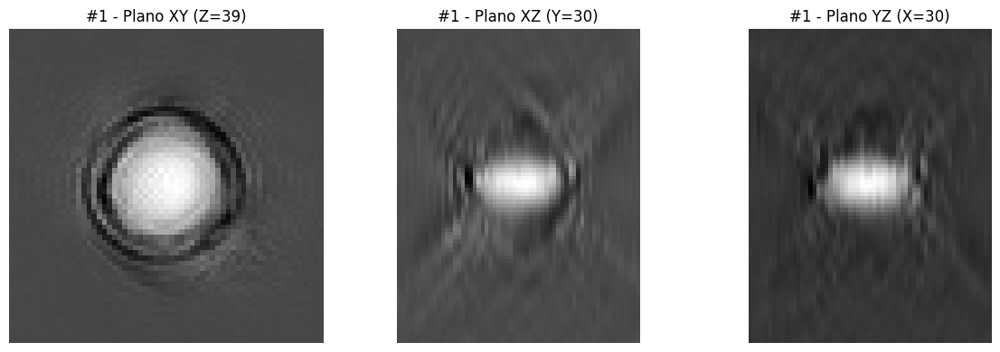
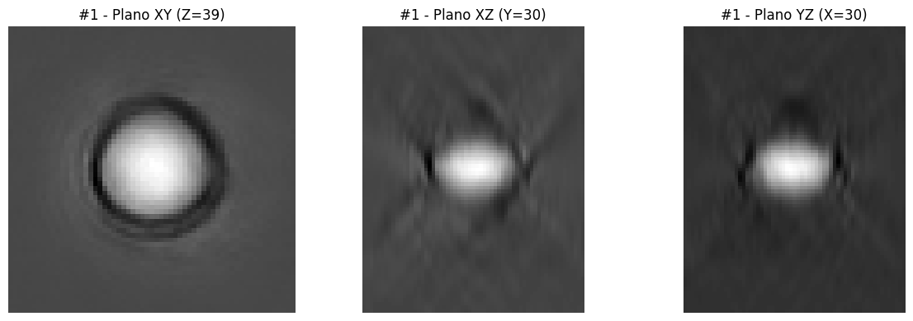
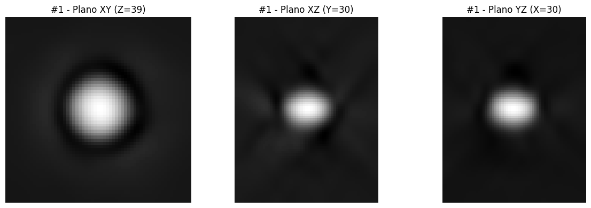
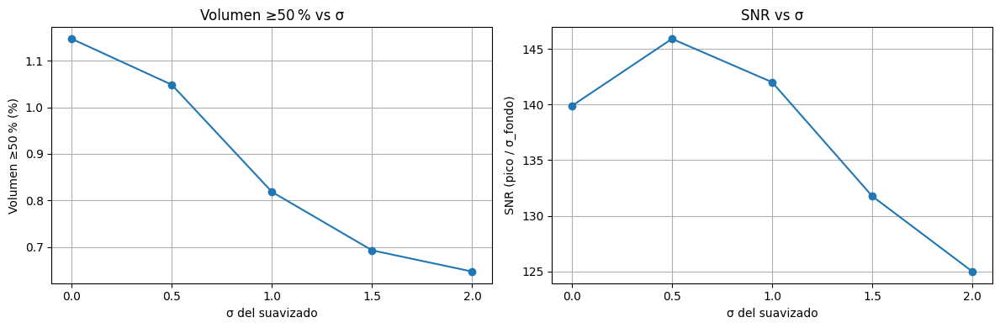
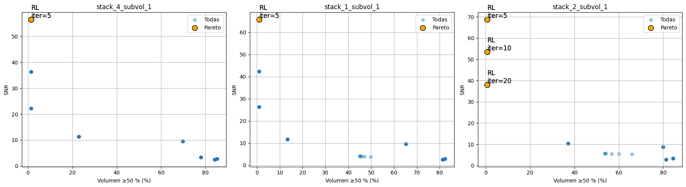
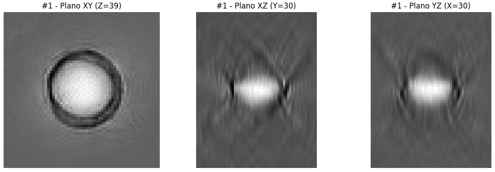
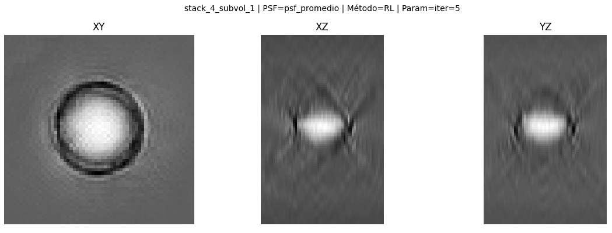
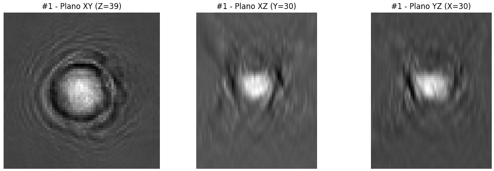
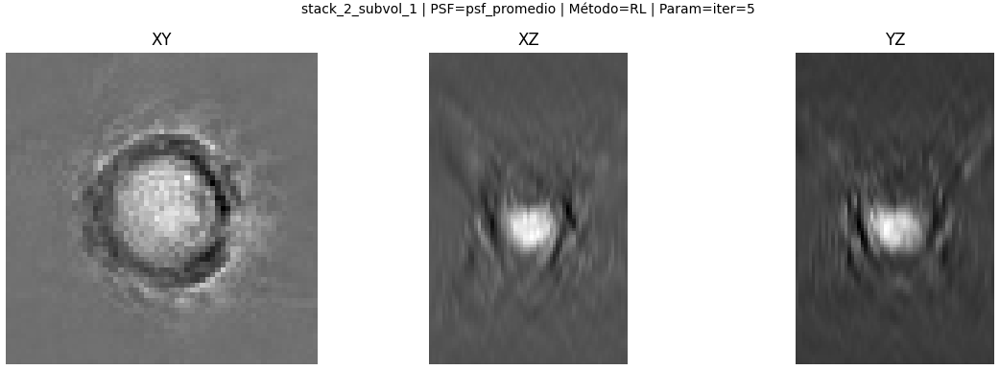
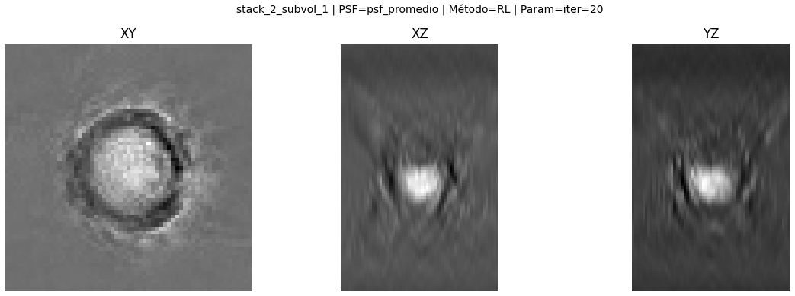

# Resultados & Conclusiones

### Visualización ortogonal de la PSF y de un subvolumen representativo

Como complemento al análisis cuantitativo, se realizó una visualización ortogonal de un subvolumen individual y de las distintas versiones suavizadas de la PSF promedio. En cada caso, se mostraron cortes centrales en los tres planos ortogonales: XY, XZ e YZ. Esto permitió observar la forma tridimensional de las estructuras, evaluar su simetría y comprobar visualmente el efecto del suavizado.

  <h3 style="text-align: center;">Original: stack 1 subvolumen 1</h3>
  
   
  <em>Figura 1. Subvolumen aislado</em>

En el subvolumen original, se aprecia la forma general de una microesfera aislada, que sirve como referencia para interpretar la PSF promedio. Al visualizar la PSF sin suavizado (σ = 0), se observa una estructura bien centrada pero con mayor presencia de ruido de fondo. A medida que aumenta el valor de σ, el núcleo se vuelve más limpio y compacto, aunque en los casos de suavizado excesivo se nota una pérdida progresiva de nitidez.

  
   
  <em>σ = 0</em>

  
   
  <em>σ = 0.5</em>

  
   
  <em>σ = 1.0</em>

  
   
  <em>σ = 2.0</em>

  <em>Figura 2. PSF filtro gaussiano</em>

Estas visualizaciones permiten contrastar visualmente la información reflejada por las métricas de volumen y SNR, y ayudan a interpretar cómo el parámetro de suavizado afecta la estructura final de la PSF.

### Evaluación de la PSF promedio y efecto del suavizado

Una vez generada la PSF promedio a partir del alineamiento y promedio de múltiples microesferas, se evaluó su comportamiento en función del nivel de suavizado aplicado. Para ello, se analizaron dos métricas complementarias sobre la PSF normalizada: el _porcentaje de voxels con intensidad mayor o igual al 50 % del valor máximo de la PSF_, y la relación señal-ruido (_SNR_), estimada como el cociente entre el valor pico(PSF) y la desviación estándar del fondo(capas superficiales del subvolumen).

  <h3 style="text-align: center;">%Voxels ≥ 50%Imax(PSF) & SNR a diferentes σ</h3>
  
  <em>Figura 3.</em>

Los resultados mostraron cómo el parámetro de suavizado (σ), aplicado mediante un filtro gaussiano, afecta de forma diferenciada la estructura de la PSF. Sin aplicar suavizado (σ = 0), el núcleo de la PSF ocupa aproximadamente un 1,15 % del volumen total, y el SNR alcanza un valor de 140. Al aplicar un suavizado leve (σ = 0,5), el volumen efectivo se reduce ligeramente, pero el SNR aumenta hasta un poco más de 145, lo que indica una mejora en la limpieza del fondo sin pérdida significativa en el pico de señal.

Un suavizado moderado (σ = 1,0) genera una reducción más pronunciada del volumen un poco más 0,82 %, es decir, un 29 % menos respecto al caso sin filtro. Mientras que el SNR se mantiene alto (más de 140), lo cual sugiere que este nivel de suavizado logra una mejor compactación del núcleo manteniendo la nitidez. Por otro lado, suavizados más agresivos (σ ≥ 1,5) ya no logran compactar mucho más la señal, pero sí reducen visiblemente el SNR, llegando a valores cercanos a 125 en σ = 2,0.

En conjunto, estos resultados permiten establecer criterios cuantitativos para elegir el nivel de suavizado más adecuado según las prioridades del análisis. Si se busca maximizar la limpieza y contraste, σ = 0,5 ofrece el mayor SNR. Si se prefiere una PSF más compacta sin sacrificar nitidez, σ = 1,0 representa un buen compromiso entre volumen reducido y señal fuerte.

### Comparación de métodos de deconvolución

Para evaluar cuál combinación de método y parámetro producía las mejores reconstrucciones, se aplicaron las configuraciones sobre tres subvolúmenes representativos. En cada caso, se calcularon dos métricas complementarias: el Volumen ≥ 50 %, que cuantifica cuán concentrado está el núcleo de la señal (análoga tridimensional al FWHM), y la relación señal-ruido (SNR), que mide cuán destacado es ese núcleo sobre el fondo. Estas métricas se graficaron para cada combinación en un plano bidimensional(Figura 4), donde el eje **X representa el volumen (a minimizar) y el eje Y el SNR (a maximizar)**.

  <h3 style="text-align: center;">Frente de Pareto</h3>
  
  <em>Figura 4.</em>

Los puntos grises del gráfico muestran todas las combinaciones evaluadas, mientras que los resaltados en naranja corresponden a aquellas que forman parte del frente de Pareto. Una combinación pertenece a este frente cuando no existe ninguna otra opción que mejore simultáneamente ambas métricas, es decir, que tenga un volumen menor y un SNR mayor. Dichas configuraciones representan los mejores compromisos posibles entre resolución y claridad.

En los tres subvolúmenes analizados se observó un comportamiento notablemente consistente. En stack_4_subvol_1 y stack_1_subvol_1, la única configuración incluida en el frente de Pareto fue Richardson-Lucy con 5 iteraciones, alcanzando un volumen central muy compacto (~1,2–1,4 %) y SNR elevados (~56–62). En stack_2_subvol_1, también dominaron variantes de RL, con tres configuraciones en el frente (iteraciones 5, 10 y 20). Sin embargo, la opción con 5 iteraciones volvió a sobresalir, presentando simultáneamente el menor volumen efectivo (~0,9 %) y el mayor SNR (~69).

A partir del análisis cuantitativo mediante el frente de Pareto, se seleccionaron las configuraciones que ofrecieron el mejor compromiso entre resolución (volumen central reducido) y nitidez (SNR elevado). Para complementar este análisis, se inspeccionaron visualmente los resultados deconvolucionados correspondientes a dichas configuraciones óptimas.

En el caso de stack_4_subvol_1(Fig 6), la deconvolución con Richardson-Lucy (5 iteraciones), si bien fue destacada por el frente de Pareto como la mejor combinación, no mostró mejoras visuales claras en la imagen reconstruida. Las estructuras observadas antes y después de la deconvolución son similares, y no se evidencia una corrección perceptible de la distorsión generada por la PSF.

  <h3 style="text-align: center;">Original: stack 4 subvolumen 1</h3>
  

  <h3 style="text-align: center;">Deconvolución con Richardson-Lucy</h3>
  
  <em>Figura 6.</em>

Para stack_2_subvol_1(Fig 7), se evaluaron los resultados deconvolucionados con el mismo método para dos niveles de iteraciones (5 y 20). Si bien puede advertirse un leve cambio en el contraste en el plano XY, no se observan diferencias sustanciales entre la imagen original y las versiones deconvolucionadas. En general, las mejoras esperadas a partir de la cuantificación no se reflejan de manera evidente en la inspección visual.

  <h3 style="text-align: center;">Original: stack 2 subvolumen 1</h3>
  

  <h3 style="text-align: center;">Deconvolución con Richardso-Lucy</h3>
  
  
  <em>Figura 7.</em>

  
Esto sugiere que, aunque las métricas utilizadas (Volumen ≥ 50 % y SNR) permitieron identificar configuraciones “óptimas” desde un punto de vista numérico, no resultaron suficientes para capturar la calidad real de la reconstrucción. En este contexto particular, las mejoras cuantitativas no se tradujeron en beneficios visuales evidentes, lo que pone en duda la idoneidad de dichas métricas como criterio único para evaluar la efectividad de la deconvolución

## Conclusiones 

En este trabajo se implementó un procedimiento completo para estimar empíricamente la función de dispersión puntual (PSF) de un sistema de microscopía 3D a partir de microesferas individuales. Se desarrolló una estrategia de detección, alineación y promedio de subvolúmenes centrados en cada esfera, obteniendo una PSF representativa del sistema. Esta estimación fue luego utilizada para aplicar distintos métodos de deconvolución mediante un flujo de trabajo automatizado en FIJI, que incluyó exploración paramétrica y generación de visualizaciones ortogonales y tridimensionales para facilitar su análisis.
Como parte de la evaluación, se definieron dos métricas cuantitativas: el  porcentaje de volumen ≥ 50 % de la intensidad máxima y la relación señal-ruido (SNR). Se aplicó un criterio de Pareto para identificar combinaciones de método, y parámetro que ofrecieran el mejor equilibrio entre compacidad (volumen reducido) y nitidez (SNR elevado). Si bien el método Richardson-Lucy con 5 iteraciones mostró el mejor rendimiento relativo según estas métricas, los resultados obtenidos revelan una limitación importante: las deconvoluciones realizadas no corrigieron visiblemente la distorsión inducida por la PSF del sistema. Esto sugiere que, en este contexto, dichas métricas no reflejan adecuadamente la calidad real de la reconstrucción y no son suficientes para evaluar de forma confiable la efectividad del proceso.
Una posible causa de esta discrepancia es el bajo número de microesferas utilizado para generar la PSF promedio, lo cual pudo derivar en una estimación poco robusta o representativa. Además, no existió una separación entre los datos utilizados para construir la PSF y aquellos sobre los que se evaluó su desempeño, lo cual limita la validez de la evaluación.
A futuro, será clave ampliar el conjunto de microesferas utilizadas, estimar la PSF sobre datos independientes y explorar nuevas métricas o estrategias de validación visual y cuantitativa. Asimismo, podrían considerarse modelos de corrección más complejos, que contemplen explícitamente la anisotropía axial y la respuesta óptica real del sistema [2](bibliografia.md#ref-psfj). Estas mejoras permitirán avanzar hacia una caracterización más precisa del sistema y una aplicación efectiva de la deconvolución en contextos experimentales reales.
