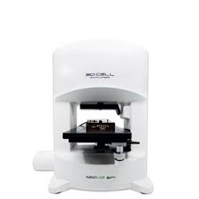
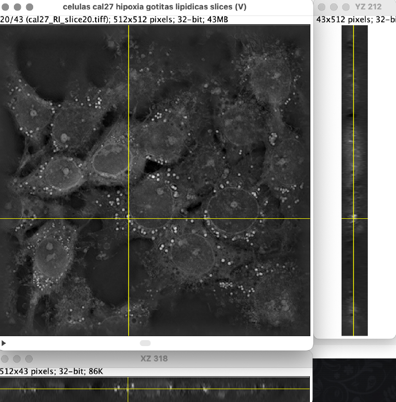

# Deconvolución de stacks de imágenes del Nanolive 3D

## Presentación del problema
El presente trabajo tiene como objetivo estimar la función de dispersión puntual (Point Spread Function, PSF) del sistema de microscopía Nanolive 3D Cell Explorer, con el fin de aplicar técnicas de deconvolución que mejoren la calidad y resolución axial de los stacks de imágenes adquiridos. Este sistema permite obtener reconstrucciones tridimensionales de células vivas sin necesidad de tinciones, utilizando tomografía holográfica. Una de sus características es la resolución anisotrópica, con mayor precisión en los planos laterales (XY) que en el eje axial (Z), lo cual hace especialmente relevante contar con una PSF adecuada para corregir dicha distorsión.

  
  <em>Figura 1.</em>

Inicialmente se propuso utilizar gotas lipídicas intracelulares como referencias para estimar la PSF. Estas estructuras esféricas, presentes de forma natural en el citoplasma, parecían una opción adecuada debido a su forma regular y su distribución relativamente aislada dentro del volumen celular. No obstante, presentaban ciertas limitaciones prácticas, como la variabilidad biológica y la dificultad para identificar gotas bien definidas y claramente aisladas.

Durante el desarrollo del trabajo surgió la posibilidad de utilizar microesferas, lo que permitió replantear la estrategia de estimación. Si bien se probaron inicialmente microesferas de 1 micrómetro de diámetro, su movimiento constante dificultó la adquisición de imágenes estables. Por ese motivo, se optó por trabajar con microesferas de 5 micrómetros, que ofrecieron mayor estabilidad y una forma perfectamente esférica. Estas características facilitaron un entorno más controlado y reproducible para la estimación de la PSF, permitiendo mejorar la calidad del análisis posterior.

  
  <em>Figura 2.</em>

## Referencias 

1. 
   **Determining the point-spread-function from a bead image by averaging.**  
   Disponible en:  
   <a href="https://haesleinhuepf.github.io/BioImageAnalysisNotebooks/18a_deconvolution/extract_psf.html" target="_blank">
   https://haesleinhuepf.github.io/BioImageAnalysisNotebooks/18a_deconvolution/extract_psf.html
   </a>

2. 
   **PSFj: Know your fluorescence microscope.**  
   Disponible en:  
   <a href="http://www.knoplab.de/psfj/" target="_blank">
   http://www.knoplab.de/psfj/
   </a>
