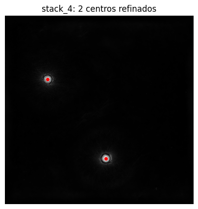

Title: Métodos
Date: 2025-05-28
Category: Page
Ordinal: 002
## Datos de entrada y estimación de la PSF

Los datos utilizados en este trabajo consisten en stacks de imágenes bidimensionales adquiridas mediante el sistema de microscopía **Nanolive 3D Cell Explorer**, basado en tomografía holográfica. Cada stack representa una reconstrucción tridimensional de una muestra que contiene **microesferas de 5 micrómetros de diámetro**, distribuidas en el volumen. Estas imágenes se almacenan en formato `.tif` y corresponden a cortes sucesivos a lo largo del eje axial (**Z**), lo que permite analizar la estructura en profundidad.

En este contexto, las microesferas se consideran **fuentes ópticas suficientemente puntuales** como para permitir la estimación de la función de dispersión puntual (**Point Spread Function**, [PSF](anexo.md#psf)) del sistema.

La PSF describe cómo un sistema óptico representa una fuente puntual ideal en una imagen. Debido a la naturaleza **anisotrópica** del sistema de adquisición con mayor resolución lateral (**XY**) que axial (**Z**). Conocer la PSF es esencial para aplicar técnicas de **deconvolución** que compensen esta distorsión y mejoren la calidad del volumen reconstruido.

A partir de los stacks adquiridos, se desarrolló una **metodología para detectar, centrar y promediar** las microesferas presentes, obteniendo así una PSF empírica que refleja el comportamiento real del sistema.

# Métodos

## Detección de microesferas en los volúmenes

### Proyección máxima en Z (MIP), ecualización y filtrado

Como primer paso para la detección de microesferas, se aplicó una **proyección de intensidad máxima** (_Maximum Intensity Projection_, MIP) sobre cada stack tridimensional. Esta técnica consiste en recorrer el volumen en la dirección axial (**Z**) y, para cada coordenada del plano (**X, Y**), conservar el valor **máximo de intensidad** registrado a lo largo de esa columna.

El resultado es una imagen bidimensional que resalta las estructuras más brillantes presentes en el volumen, independientemente de su profundidad. En este caso, la MIP permite visualizar de forma clara la ubicación aproximada de las microesferas, que se manifiestan como **regiones de alta intensidad** en el plano proyectado, facilitando así su detección inicial.

Para mejorar la visibilidad de las microesferas en la imagen proyectada, se aplicaron dos operaciones sucesivas: **ecualización adaptativa del histograma** y **filtrado gaussiano**. La ecualización adaptativa _ajusta el contraste_ de manera localizada, redistribuyendo los _niveles de intensidad_ para que regiones oscuras o poco contrastadas se vuelvan más distinguibles, sin alterar drásticamente la apariencia global de la imagen. Esto permite resaltar esferas que podrían haber quedado opacadas por condiciones de iluminación desbalanceadas.

A continuación, se aplicó un **suavizado mediante un filtro gaussiano**, que atenúa el ruido fino y las pequeñas variaciones de intensidad, conservando las estructuras de mayor escala, como las microesferas.

Como paso final del preprocesamiento, se descartó un **margen fijo en los bordes** de la imagen para evitar detecciones espurias causadas por artefactos o recortes incompletos en los extremos del campo visual.

### Selección de microesferas

Para detectar las microesferas en la imagen proyectada, se utilizó el filtro ´**Laplaciano de Gaussiano** (LoG), una técnica comúnmente empleada para identificar “blobs”: regiones aproximadamente circulares con intensidad homogénea. Este filtro combina un suavizado inicial con un filtro gaussiano seguido por la aplicación del operador Laplaciano, que resalta los bordes de estructuras brillantes. Evaluando la respuesta del filtro en múltiples escalas es posible detectar objetos de distintos tamaños dentro de la imagen.

En este caso, se aplicó el algoritmo `blob_log` de la biblioteca `skimage`, ajustando el rango de escalas para detectar estructuras con un radio cercano al esperado para las microesferas (≈23 píxeles). Como resultado, se obtuvo un conjunto de coordenadas bidimensionales (X, Y) correspondientes a las posibles ubicaciones de microesferas en la imagen proyectada.

Para asegurar que las detecciones seleccionadas fueran independientes entre sí, se descartaron aquellas que presentaban una vecina a una distancia menor a dos veces el diámetro estimado (≈46 píxeles). De esta manera, solo se conservaron las microesferas suficientemente aisladas, evitando posibles solapamientos en los subvolúmenes extraídos y asegurando una estimación más confiable de la PSF.

### Estimación de la coordenada Z

Para completar la localización tridimensional de cada microesfera, se estimó su coordenada Z a partir de las posiciones previamente detectadas en el plano (X, Y). Para ello, se recorrió la columna de vóxeles correspondiente a cada par (X, Y) a lo largo del eje Z, y se identificó el plano que presentaba el valor máximo de intensidad. Este procedimiento se basa en la suposición de que la microesfera aparece más enfocada y, por tanto más brillante en ese plano, lo cual permite una estimación inicial de su centro en profundidad.

Esto se implementó recorriendo la columna de intensidad en cada coordenada con `stack[:, y, x]` y utilizando `np.argmax(...)` para obtener el índice Z correspondiente al valor máximo, lo que define la coordenada axial de cada centro detectado.

### Refinamiento mediante contornos

Para mejorar la precisión de la localización espacial de las microesferas, especialmente en el plano (X, Y), se aplicó un procedimiento de refinamiento basado en el análisis de contornos. A partir de cada coordenada estimada (Z, Y, X), se extrajo una ventana bidimensional centrada en (Y, X) sobre el plano Z correspondiente. Esta región, de tamaño fijo, se normalizó a escala de 8 bits y fue segmentada mediante el umbral automático de **Otsu**, un método que determina un valor de _corte óptimo_ para separar los píxeles en dos clases: **fondo y objeto**. En este caso, permite aislar de forma robusta la microesfera, que se presenta como una región de mayor intensidad dentro de la ventana.

  
  <em>Figura 4.</em>

Luego, se detectaron los contornos presentes en la máscara binaria generada, y se seleccionó el contorno con mayor área. A partir de este, se calculó el centroide, lo que permitió refinar las coordenadas (X, Y) originales con precisión subpixel. Este ajuste fue crucial para alinear correctamente las microesferas en los pasos posteriores de extracción y promedio.

## Extracción, alineación y generación de la PSF

A partir de las microesferas detectadas y refinadas, se extrajeron subvolúmenes centrados en cada una de ellas para estimar la función de dispersión puntual (PSF) del sistema. Para cada stack, ya se contaba con un conjunto de coordenadas tridimensionales refinadas (Z, Y, X) que indicaban la posición del centro de cada microesfera.

Con estos centros identificados, se extrajo un subvolumen cúbico alrededor de cada microesfera, conteniendo su entorno inmediato. El tamaño lateral del subvolumen se mantuvo constante, mientras que la dimensión axial (Z) se ajustó de forma específica para asegurar una correcta alineación vertical entre todas las muestras.

Dado que la posición axial (Z) de cada microesfera podía variar ligeramente entre stacks, se aplicó un procedimiento de alineación para asegurar que todas quedaran centradas a la misma profundidad dentro del subvolumen. Para lograrlo, se calculó, para cada microesfera, cuántos slices podían recortarse por encima y por debajo de su plano central sin salirse del volumen original. Luego, se determinó el margen simétrico máximo que podía aplicarse a todas las microesferas sin exceder los límites del stack. Con ese valor común, se extrajo para cada caso un subvolumen con profundidad uniforme, alineado en torno a su centro Z. Este paso fue esencial para garantizar la correcta superposición en el promedio posterior.

Una vez extraídos y alineados todos los subvolúmenes, se normalizaron y apilaron en una estructura común para su procesamiento conjunto. Se calculó el promedio voxel a voxel entre todos los subvolúmenes, generando así una estimación tridimensional de la PSF del sistema [1](bibliografia.md#ref-psf-bead). Este volumen promedio conserva la forma característica de las microesferas pero filtrada por la respuesta óptica del sistema.

Sobre esta PSF promedio se aplicaron filtros gaussianos con distintos niveles de suavizado, variando el parámetro sigma. Esto permitió obtener versiones más o menos suavizadas de la función, adaptables según las necesidades del proceso de deconvolución posterior. Todas las variantes generadas fueron almacenadas para su uso posterior en herramientas externas como FIJI.

Los subvolúmenes extraídos y las distintas versiones de la PSF generada fueron almacenados en carpetas separadas: `pre_deconvolucion/subvolumenes` y `pre_deconvolucion/psfs`, respectivamente. Esta organización permite acceder fácilmente a los archivos necesarios para su utilización en la etapa de deconvolución, que se realiza en FIJI.

### Deconvolución en FIJI

Para la etapa de deconvolución se utilizó la plataforma **FIJI** (Fiji Is Just ImageJ), un entorno ampliamente empleado para el procesamiento y análisis de imágenes científicas. En particular, se utilizó el plugin **DeconvolutionLab2**, que permite aplicar distintos algoritmos de deconvolución tridimensional sobre stacks de imágenes, combinando datos experimentales con modelos personalizados de PSF.

En este trabajo se desarrolló un **macro automatizado** que recorre todas las combinaciones de subvolúmenes y PSFs generadas previamente, aplicando sobre cada una de ellas diferentes métodos de deconvolución.

Los métodos aplicados fueron seleccionados por su capacidad para recuperar detalles en datos volumétricos con distintos niveles de ruido y degradación:

- **Richardson-Lucy (RL):** algoritmo iterativo ampliamente utilizado para la deconvolución de imágenes con ruido Poisson. Parte de un modelo estadístico de formación de imagen y ajusta progresivamente la reconstrucción en función de la PSF observada. Su simplicidad y efectividad lo hacen una opción de referencia en entornos de microscopía.

- **Tikhonov Regularized Inverse Filter (TRIF):** se basa en la inversión directa del sistema de formación de imagen, pero incorpora una regularización de tipo Tikhonov para controlar la amplificación del ruido. Este enfoque permite suavizar la reconstrucción en función del nivel de regularización elegido, y es útil cuando se busca un balance entre recuperación de detalles y supresión del ruido.

- **Richardson-Lucy con regularización por variación total (RLTV):** combina el enfoque iterativo de RL con una penalización basada en la variación total de la imagen, lo que ayuda a preservar bordes definidos mientras se reduce el ruido de fondo. Este método resulta particularmente útil cuando se desea mantener estructuras nítidas sin introducir artefactos por sobreprocesamiento.

Para cada uno de los métodos seleccionados se exploró una **grilla de parámetros relevantes**. En el caso de RL y RLTV se variaron las cantidades de iteraciones, mientras que en TRIF se probaron diferentes valores del parámetro de regularización (`lambda`). Esta estrategia permitió evaluar cómo afecta cada configuración a la calidad de la reconstrucción y seleccionar combinaciones adecuadas según el tipo de regularización deseado.

Los resultados obtenidos se almacenaron en carpetas separadas según el método aplicado (`RL/`, `TRIF/`, `RLTV/`) y organizados por parámetro, facilitando su comparación posterior. Además, se generó automáticamente un registro estructurado (`log_deconvoluciones.csv`) que documenta, para cada subvolumen, el método utilizado, los parámetros aplicados y la ubicación del archivo de salida correspondiente.

Como parte del análisis cualitativo, se utilizó el plugin **3D Viewer** de FIJI para visualizar algunos de los resultados deconvolucionados en tres dimensiones. El objetivo fue evaluar si los métodos aplicados permitían **recuperar un volumen bien definido correspondiente a la microesfera**, diferenciándolo del ruido circundante.

Además, en la **notebook de procesamiento** se generaron visualizaciones de los subvolúmenes deconvolucionados, mostrando **cortes ortogonales en los planos XY, XZ e YZ** para facilitar la inspección visual de la mejora obtenida tras la deconvolución.

## Análisis cuantitativo de la calidad de la PSF

### Evaluación del suavizado de la PSF

Una vez generada la PSF promedio a partir del alineamiento y promedio de múltiples microesferas, se evaluó su comportamiento en función del nivel de suavizado aplicado. Para ello, se analizaron dos métricas complementarias sobre la PSF normalizada: el volumen efectivo y la relación señal-ruido (SNR), en función del parámetro de suavizado σ.

**Volumen ≥ 50 % (Media‐Height Volume):** número de voxeles con **intensidad mayor o igual al 50 % del valor máximo de la PSF normalizada**. Este valor representa cuán concentrada está la energía de la PSF en torno a su centro, siendo análogo a la anchura a media altura (FWHM) pero expresado como volumen en lugar de distancia. Un volumen pequeño indica mayor resolución espacial.

**Relación señal-ruido (SNR):** cociente entre la intensidad máxima de la PSF (el pico) y la desviación estándar del fondo. En este contexto, el fondo se estima a partir de las capas periféricas del subvolumen (es decir, las primeras y últimas capas en cada eje, donde no se espera señal real). La fórmula empleada fue:

$$
\text{SNR} = \frac{I_{\text{máx}}}{\sigma_{\text{fondo}}}
$$

Estas métricas se calcularon para cada una de las PSFs suavizadas con diferentes valores de σ. Los resultados se visualizaron mediante dos curvas: una que muestra cómo varía el volumen ≥ 50 % con el suavizado, y otra que representa la evolución de la SNR. Esta doble visualización permite balancear la compactación espacial de la PSF con su limpieza, proporcionando un criterio objetivo para elegir el valor óptimo de suavizado.

### Análisis del frente de Pareto

Además del análisis sobre la PSF promedio, se evaluó el efecto de distintos algoritmos y parámetros de deconvolución aplicados a subvolúmenes representativos. Para ello, se calcularon las mismas dos métricas **volumen ≥ 50 % y SNR** sobre los resultados de deconvolución de tres subvolúmenes específicos.

Para cada combinación de método y parámetro evaluada, se calculó el porcentaje de voxeles con intensidad superior al 50 % del máximo y la SNR correspondiente, luego de normalizar el volumen al rango [0,1]. Estos valores se representaron en un plano donde el eje X corresponde al volumen (a minimizar) y el eje Y al SNR (a maximizar).

En este contexto, se identificó el frente de Pareto, es decir, el conjunto de combinaciones no dominadas por ninguna otra. Una combinación se considera no dominada si no existe otra que mejore **simultáneamente ambas métricas**. El frente de Pareto permite reducir el conjunto de resultados a aquellas configuraciones que representan el mejor compromiso entre resolución _(volumen reducido) y nitidez (SNR elevado)_, facilitando una comparación objetiva entre métodos de deconvolución.

